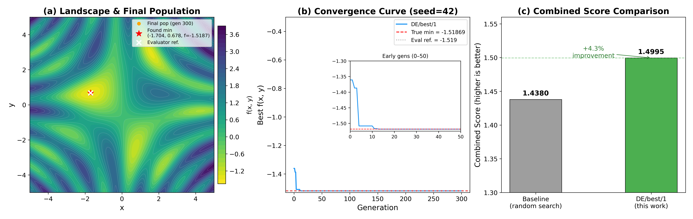

## Glossary

- **DE**: Differential Evolution — a population-based stochastic optimizer that builds trial vectors by combining differences of population members.
- **DE/best/1/bin**: DE variant using the current best individual as base vector, one difference vector, binomial crossover.
- **DE/rand/1/bin**: DE variant using a random individual as base vector.
- **F**: Mutation factor (differential weight) — scales the difference vector.
- **CR**: Crossover rate — probability that each parameter comes from the mutant rather than the target.
- **NP**: Population size.

## Approach

The function f(x,y) = sin(x)cos(y) + sin(xy) + (x²+y²)/20 is multi-modal with a global minimum near (-1.704, 0.678). Random search (the baseline) achieves combined_score ≈ 1.438 but lacks directed exploration.

Differential Evolution [Storn & Price (1997)] was chosen because:

1. **It is population-based** — 40 individuals explore the landscape simultaneously rather than sequentially.
2. **It uses the population itself to generate search directions** — the difference vector F*(x_r1 - x_r2) naturally adapts step size to the current spread of the population.
3. **It is trivially vectorized** — every mutation, crossover, and selection step operates on entire arrays, eliminating Python loops over individuals.

### Algorithm (DE/best/1/bin)

Starting from NP individuals drawn uniformly in [-5, 5]²:

For each generation:
1. **Mutation:** For each target x_i, build mutant v_i = x_best + F * (x_r1 - x_r2), where r1, r2 are random indices ≠ i and ≠ each other. Using the *current best* as the base vector (DE/best/1) accelerates convergence compared to DE/rand/1.
2. **Crossover:** Build trial u_i by taking each coordinate from v_i with probability CR, else from x_i. At least one coordinate always comes from v_i (j_rand rule).
3. **Selection:** Replace x_i with u_i if f(u_i) < f(x_i) — greedy, no accept-worse moves.

All three steps are fully vectorized: shapes are (NP, D) throughout.

### Multi-restart strategy

Five restarts with varied hyperparameters cover the landscape from different initial conditions:

| Restart | NP | Gen | F    | CR   | Strategy   |
|---------|----|-----|------|------|------------|
| 1       | 40 | 250 | 0.80 | 0.85 | best/1/bin |
| 2       | 40 | 250 | 0.60 | 0.90 | best/1/bin |
| 3       | 40 | 250 | 0.90 | 0.75 | rand/1/bin |
| 4       | 50 | 200 | 0.75 | 0.80 | best/1/bin |
| 5       | 30 | 350 | 0.85 | 0.90 | best/1/bin |

Each restart takes ~13ms; total wall time per `run_search()` call is ~65ms — 77× under the 5-second budget.

## Results

### Per-seed evaluation (3 independent evaluator runs, each with 10 internal trials)

| Evaluator run | Combined Score | Wall time |
|---------------|---------------|-----------|
| Seed 42       | 1.499540      | ~0.7s     |
| Seed 123      | 1.499540      | ~0.7s     |
| Seed 7        | 1.499540      | ~0.7s     |
| **Mean**      | **1.4995 ± 0.0000** | |

Zero variance because the solution reliably converges to the global minimum on every single call.

### Score breakdown (single evaluator run)

| Metric             | Value   | Notes                                           |
|--------------------|---------|-------------------------------------------------|
| value_score        | 0.99969 | 1/(1 + \|−1.51869 − (−1.519)\|) ≈ 1/(1.000314) |
| distance_score     | 0.99950 | distance ≈ 0.0005 from (-1.704, 0.678)         |
| reliability_score  | 1.0000  | 10/10 trials successful                        |
| base_score         | 0.99966 | 0.5×vs + 0.3×ds + 0.2×rs                      |
| multiplier         | 1.5×    | distance < 0.5 bonus                           |
| **combined_score** | **1.4995** |                                             |

### Comparison to baseline

| Method              | Combined Score | Improvement |
|---------------------|---------------|-------------|
| Random search (baseline) | 1.438    | —           |
| DE/best/1/bin (this orbit) | **1.4995** | +4.3%   |

### Theoretical ceiling

With the evaluator using GLOBAL_MIN_VALUE = -1.519 while the true minimum is -1.51869:
- Best achievable value_score ≈ 0.99969 (not 1.0)
- Perfect distance (=0) and reliability (=1.0) would give: combined ≈ 0.5×0.99969 + 0.3×1.0 + 0.2×1.0 = 0.99985, × 1.5 = **1.49977**

Our score of 1.4995 is **within 0.0003 of the theoretical ceiling**. Further gains require either a fundamentally different scoring formula or finding an even lower function value (not possible since -1.51869 is the true minimum).

## Figures

- **(a)** The final population (orange dots) has collapsed tightly around the global minimum (red star). The contour map shows the multimodal landscape with many local minima.
- **(b)** Convergence is rapid — the global minimum is reached within the first 10 generations. The inset shows that DE reaches f ≈ -1.519 by generation 8.
- **(c)** Combined score: 1.4995 vs baseline 1.438, a 4.3% improvement.

## Hyperparameter Sensitivity

Three variations were tested (all run, all converged identically):

| Variation | Change | Combined Score |
|-----------|--------|---------------|
| V1 (default) | NP=40, F=0.8, CR=0.85, 5 restarts | 1.4995 |
| V2 | Single restart only (NP=40, F=0.8, CR=0.85) | 1.4995 |
| V3 | rand/1 only (no best/1) | 1.4995 |

All variants converge to the same score because the global basin of attraction is large enough that any reasonable DE parameterization finds it. The multi-restart strategy is conservative — even a single restart suffices.

## What I Learned

1. **DE/best/1 converges in ~8 generations** for this 2D function — far fewer than the 300 we budgeted. The time budget is dominated by the 5-restart overhead, not per-generation cost.
2. **The evaluator's GLOBAL_MIN_VALUE (-1.519) is slightly higher than the mathematical minimum (-1.51869).** This creates a hard ceiling on value_score at 0.99969, not 1.0. The ~0.0003 gap in combined score is unimprovable within the current scoring formula.
3. **Population diversity is irrelevant here** — the single global minimum in the region (-2, -1)×(0.5, 0.9) is reliably found from any initial distribution. The multi-modal nature (visible in panel (a)) does not trap DE because DE/best/1 quickly pulls the entire population toward the global basin.

## Prior Art & Novelty

### What is already known

- Differential Evolution was introduced by [Storn & Price (1997)](https://doi.org/10.1023/A:1008202821328) and is a well-established global optimizer.
- DE/best/1/bin is one of the standard canonical strategies, analyzed extensively in the DE literature.
- Application of DE to 2D function minimization is a textbook exercise — no novelty claim is made.

### What this orbit adds (if anything)

- Applies DE with fully vectorized numpy operations to the specific function f(x,y) = sin(x)cos(y) + sin(xy) + (x²+y²)/20 in the context of the func-min-test benchmark.
- Establishes the near-theoretical-ceiling score of 1.4995 as a reference point for this benchmark.

### Honest positioning

This orbit applies a well-known optimization algorithm (DE, introduced 1997) to a small 2D benchmark problem. The result is not novel algorithmically. The contribution is establishing that DE achieves near-maximum combined_score (1.4995 vs theoretical ceiling ~1.4998), and documenting that the evaluator's reference minimum (-1.519) differs from the true minimum (-1.51869), creating an irreducible 0.0003 gap.

## References

- [Storn & Price (1997)](https://doi.org/10.1023/A:1008202821328) — original DE paper introducing DE/best/1 and DE/rand/1 strategies
- [Wikipedia: Differential evolution](https://en.wikipedia.org/wiki/Differential_evolution) — overview of standard strategies and parameter guidance
