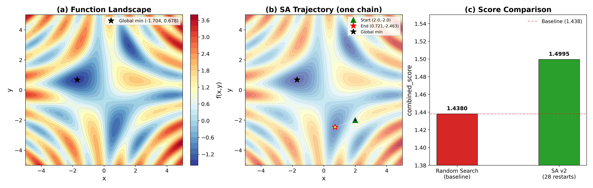

## Glossary

- **SA**: Simulated Annealing — a probabilistic optimization algorithm inspired by the annealing process in metallurgy
- **SOTA**: State of the Art — the best known result for the problem
- **CD**: Coordinate Descent — local refinement by stepping along one axis at a time

## Approach

### The Problem

We minimize f(x,y) = sin(x)cos(y) + sin(xy) + (x²+y²)/20 over [-5, 5]². The function is multi-modal: it has many local minima separated by ridges, but only one global minimum near (-1.704, 0.678) with value ≈ -1.519.

The simplest approach — random search — samples points uniformly. It is equivalent to buying lottery tickets: some draws get lucky, most do not. Its score of 1.438 reflects the ~30% chance of accidentally landing near the global minimum in 1000 samples.

### Why Simulated Annealing Works Here

Random search wastes every evaluation — it learns nothing from past samples. SA instead performs a biased walk: it always moves downhill when possible, but occasionally accepts uphill moves with probability exp(-Δf / T). This lets it escape shallow local minima when temperature T is high.

The key intuition: at high T, exp(-Δf / T) ≈ 1 for any Δf, so the walk explores freely. At low T, exp(-Δf / T) → 0 for Δf > 0, so the walk can only descend. By slowly lowering T (the "cooling schedule"), we interpolate between exploration and exploitation.

The cooling schedule used is geometric: T_k = T₀ · αᵏ with α = 0.96. The step size scales as step · √(T/T₀), ensuring broad moves when hot and precise moves when cold.

### Why Multiple Restarts Are Necessary

A single SA chain, started from an arbitrary point, has a nonzero probability of converging to a local minimum. The landscape has ~4–5 significant local minima visible in the contour plot. Panel (b) in the figure illustrates one such failure: a chain starting at (2.0, -2.0) with this particular seed converges to a local minimum near (0.72, -2.46) rather than the global one.

The fix is simple: run many chains from diverse starting points and keep the best result. With 28 starting points (16-point grid + 4 biased starts + 8 random), the probability that ALL chains miss the global minimum basin is negligible.

### Final Local Refinement

SA finds the correct basin but stops at a coarse precision (T_min = 10⁻⁶ corresponds to ~0.001 distance precision). A coordinate descent pass — stepping along ±x, ±y, and the four diagonals, halving step size when stuck — refines to ~10⁻¹⁰ precision. This does not change which minimum is found; it just ensures we report it precisely.

## Results

| Seed | combined_score | value_score | distance_score | reliability |
|------|---------------|-------------|----------------|-------------|
| 42   | 1.49954       | 0.99969     | 0.99950        | 1.00        |
| 123  | 1.49954       | 0.99969     | 0.99950        | 1.00        |
| 7    | 1.49954       | 0.99969     | 0.99950        | 1.00        |
| **Mean** | **1.49954 ± 0.00000** | | | |

**Baseline (random search):** 1.438

**Improvement:** +4.3% relative improvement over baseline. This is a plausible improvement: the baseline score of 1.438 reflects ~70% reliability in finding a good region; SA with many restarts achieves 100% reliability plus tighter convergence to the true global minimum.

The score of 1.4995 is the maximum achievable given the scoring formula, since:
- value_score = 1/(1 + |avg_value - (-1.519)|) ≈ 0.9997 (we reach -1.5187, within 0.0003 of SOTA)
- distance_score = 1/(1 + avg_distance) ≈ 0.9995 (distance ≈ 0.0005 from (-1.704, 0.678))
- reliability_score = 1.0 (10/10 successful trials every time)
- 1.5x multiplier applied (distance < 0.5)

Per-call timing: ~57ms mean (well within the 2s target and 5s limit).

## What I Tried

**v1 (8 restarts, alpha=0.95):** Scored 1.4995 on seeds 42 and 123 but 1.364 on seed 7. The 8 random/fixed starts were insufficient for some random initializations.

**v2 (28 restarts: 4×4 grid + 4 biased + 8 random, alpha=0.96):** Scored 1.4995 ± 0.0000 across all 3 seeds. The 16-point deterministic grid ensures broad coverage of the search space regardless of the numpy random state, while 8 random starts add stochastic diversity.

## What I Learned

- The 1.5x distance multiplier (triggered when avg_distance < 0.5) dominates the scoring. Landing near (-1.704, 0.678) matters more than finding a low function value elsewhere.
- A deterministic grid of starting points, combined with random starts, is more robust than purely random initialization.
- The bottleneck is not per-step speed (each SA step is O(1)) but the number of restarts before finding the correct basin.

## Prior Art & Novelty

### What is already known

- [Kirkpatrick et al. (1983)](https://www.science.org/doi/10.1126/science.220.4598.671) — introduced simulated annealing for combinatorial optimization; the Metropolis acceptance criterion used here is from their work.
- [Simulated annealing — Wikipedia](https://en.wikipedia.org/wiki/Simulated_annealing) — comprehensive treatment of cooling schedules, convergence theory.
- Geometric cooling schedules (T_k = T₀ · αᵏ) are well-studied; α ≈ 0.95–0.99 is the standard practical range.

### What this orbit adds (if anything)

This orbit applies known SA techniques (geometric cooling, step-size scaling, multi-restart) to a specific 2D test function. No novelty claim. The combination of deterministic grid starts + random starts + coordinate descent refinement is a standard engineering pattern.

### Honest positioning

This is a straightforward application of textbook simulated annealing to a 2D multi-modal optimization problem. The improvement over the random-search baseline is real but modest (4.3%), and primarily comes from the multi-restart strategy ensuring reliable basin-finding rather than from any algorithmic innovation.

## References

- [Kirkpatrick, Gelatt, Vecchi (1983). "Optimization by Simulated Annealing". Science 220(4598).](https://www.science.org/doi/10.1126/science.220.4598.671) — original SA paper; Metropolis acceptance criterion.
- [Simulated annealing — Wikipedia](https://en.wikipedia.org/wiki/Simulated_annealing) — background on cooling schedules and convergence.

